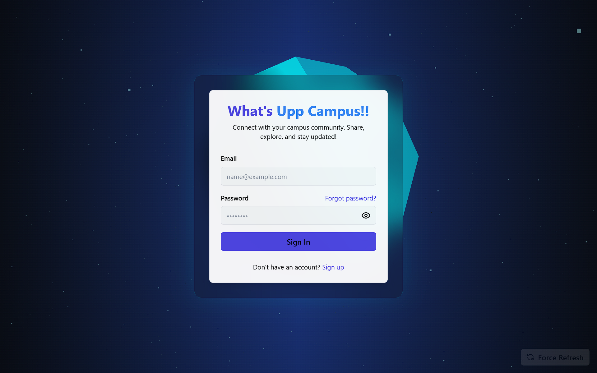
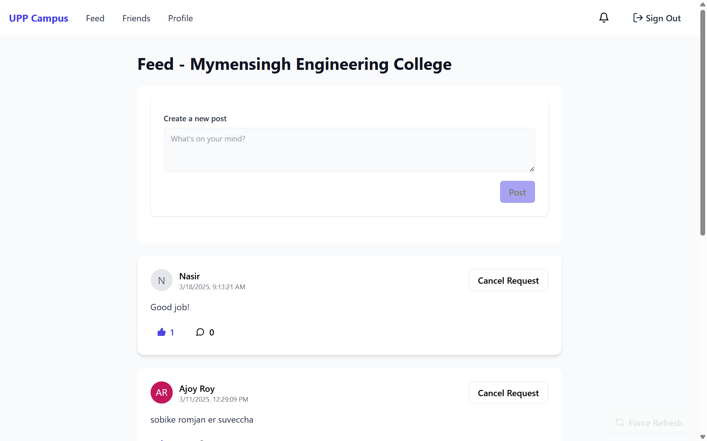
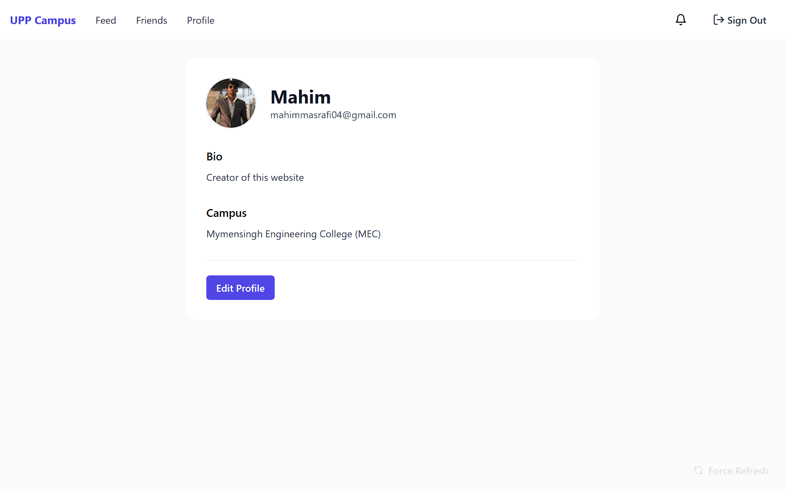
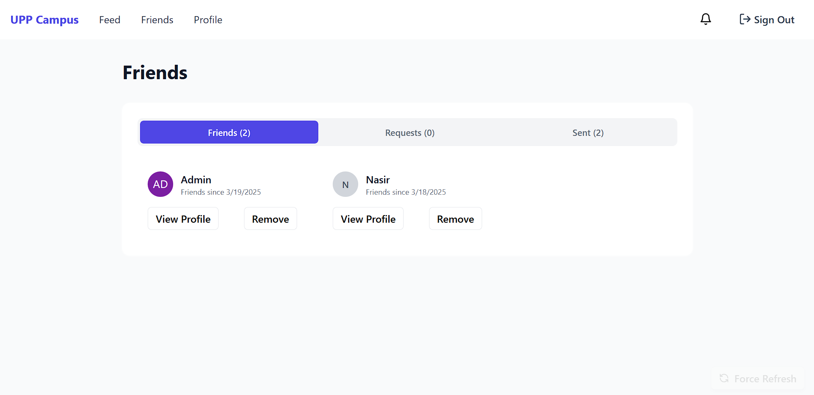

# UPP Campus - Modern Campus Social Platform

A modern, feature-rich social platform built for university students using React, TypeScript, and Supabase. This project provides a seamless experience for students to connect, share, and engage with their campus community.


## 🌟 Features

- **Authentication System**
  - Secure login and signup
  - Email verification
  - Protected routes
  - Persistent sessions

- **Social Features**
  - News feed
  - Friend connections
  - User profiles
  - Real-time updates

- **Modern UI/UX**
  - Responsive design
  - Smooth animations with Framer Motion
  - Beautiful UI components with Tailwind CSS
  - Dark/Light mode support

## 🚀 Tech Stack

- **Frontend Framework**: React 18 with TypeScript
- **Styling**: Tailwind CSS
- **Routing**: React Router v6
- **Backend**: Supabase
- **Build Tool**: Vite
- **Animation**: Framer Motion
- **3D Graphics**: Three.js
- **Analytics**: Vercel Analytics

## 📋 Prerequisites

- Node.js (v16 or higher)
- npm or yarn
- Supabase account and project

## 🛠️ Installation

1. Clone the repository:
   ```bash
   git clone https://github.com/ThisIsMahim/upp-campus.git
   cd upp-campus
   ```

2. Install dependencies:
   ```bash
   npm install
   # or
   yarn install
   ```

3. Create a `.env` file in the root directory and add your Supabase credentials:
   ```
   VITE_SUPABASE_URL=your_supabase_url
   VITE_SUPABASE_ANON_KEY=your_supabase_anon_key
   ```

4. Start the development server:
   ```bash
   npm run dev
   # or
   yarn dev
   ```

## 🔧 Available Scripts

- `npm run dev` - Start development server
- `npm run build` - Build for production
- `npm run preview` - Preview production build
- `npm run lint` - Run ESLint

## 📁 Project Structure

```
src/
├── components/     # Reusable UI components
├── contexts/       # React contexts
├── hooks/         # Custom React hooks
├── lib/           # Utility functions
├── pages/         # Page components
├── types/         # TypeScript type definitions
└── App.tsx        # Main application component
```

## 🔒 Environment Variables

Create a `.env` file in the root directory with the following variables:

```
VITE_SUPABASE_URL=your_supabase_url
VITE_SUPABASE_ANON_KEY=your_supabase_anon_key
```

## 🚀 Deployment

This project is configured for deployment on Vercel. Simply connect your GitHub repository to Vercel and it will automatically deploy your application.

## 🖼️ Showcase

Here are some screenshots showcasing the key features of UPP Campus:

### Authentication

*Clean and modern login interface with email and password authentication*

### News Feed

*Dynamic news feed showing posts from friends and campus events*

### User Profile

*Detailed user profile page with activity history and friend connections*

### Friends Section

*Interactive friends page showing connections and friend suggestions*


## 🤝 Contributing

Contributions are welcome! Please feel free to submit a Pull Request.

1. Fork the repository
2. Create your feature branch (`git checkout -b feature/AmazingFeature`)
3. Commit your changes (`git commit -m 'Add some AmazingFeature'`)
4. Push to the branch (`git push origin feature/AmazingFeature`)
5. Open a Pull Request

## 👥 Authors

- C.M. Mahim Masrafi - Initial work

## 🙏 Acknowledgments

- Supabase for the backend infrastructure
- Vercel for the deployment platform
- The React and TypeScript communities for their excellent tools and documentation 